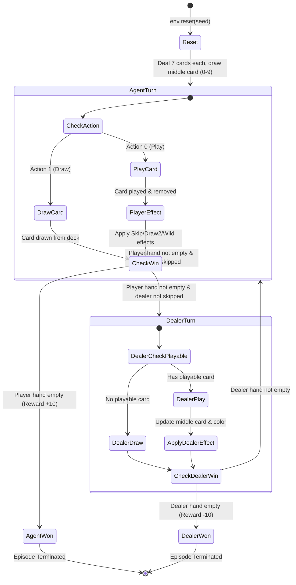

CS 272 Assignment 2
Name: Yuanxin Ma, Devi Kamakshi Thiruvadisoolam Venkateswaran (Pair 4)
Link to repo: [pa2-agent](https://github.com/mayuanxin1234/custom-env/tree/main/pa2-agent)

---

### Rendered map/state diagram of environment and 1 paragraph description of it:



**Environment Description**:
`cs272/Uno-v0` is a 2-player custom Gymnasium environment implementing a simplified version of UNO between an RL agent and an automated dealer. The environment features a 108-card deck with 4 colors (1=Red, 2=Blue, 3=Green, 4=Yellow) and special action cards (Skip, Reverse, Draw Two, Wild, and Wild Draw Four). The action space is `Discrete(2)` representing `0: Play` (plays the first valid matching card or wild card in hand) and `1: Draw` (draws a top card from the deck). To meet the assignment's $<500$ state space constraint for tabular RL, observations are encoded into a single integer index $S \in [0, 159]$ computed as $\text{state} = (\min(\text{player\_hand\_size}, 19) \times 4 + (\text{current\_color} - 1)) \times 2 + \text{has\_playable}$. Transitions are stochastic via Gymnasium's seeded `self.np_random` generator. The agent receives $+10.0$ for winning (emptying hand or dealer emptying hand), $-10.0$ for losing, $+1.0$ for playing a card, $-1.0$ for drawing or invalid play, and episodes truncate at 300 steps via `max_episode_steps`.

---

### Sample episode of greedy policy:

```text
Evaluating trained SARSA(λ=0.9) policy with exploration=False (Greedy Execution):

Middle card: 210, Dealer cards: 7, Your cards (6): [320, 230, 207, 220, 220, 600]
Middle card: 230, Dealer cards: 9, Your cards (5): [320, 207, 220, 220, 600]
Middle card: 203, Dealer cards: 8, Your cards (4): [320, 220, 220, 600]
Middle card: 220, Dealer cards: 8, Your cards (3): [320, 220, 600]
Middle card: 320, Dealer cards: 8, Your cards (2): [220, 600]
Middle card: 220, Dealer cards: 8, Your cards (1): [600]
Middle card: 600, Dealer cards: 12, Your cards (0): [] (Player Won!)

Step  1 | State:  57 | Action: Play (0) | Reward:  +1.0
Step  2 | State:  49 | Action: Play (0) | Reward:  +1.0
Step  3 | State:  47 | Action: Play (0) | Reward:  +1.0
Step  4 | State:  55 | Action: Play (0) | Reward:  +1.0
Step  5 | State:  40 | Action: Draw (1) | Reward:  -1.0
Step  6 | State:  48 | Action: Draw (1) | Reward:  -1.0
Step  7 | State:  59 | Action: Play (0) | Reward:  +1.0
Step  8 | State:  51 | Action: Play (0) | Reward:  +1.0
...
Step 77 | State:   8 | Action: Play (0) | Reward:  -1.0
Step 78 | State:   9 | Action: Play (0) | Reward: +10.0

Episode Summary: Total Steps = 78 | Undiscounted Return = +27.00 | Discounted Return = +16.46 | Clean Termination = True
```

---

### Lambda sweep plot and table:


#### Final Multi-Seed Experimental Results Table (5 Seeds Average):

| λ | Episodes to Target | Mean Final Return |
| :---: | :---: | :---: |
| **0.0** | **100.0** | **6.0440** |
| **0.3** | **100.0** | **6.1540** |
| **0.6** | **102.8** | **6.2240** |
| **0.9** | **168.2** | **6.2660** |
| **1.0** | **309.8** | **3.1020** |

*Note on Previous Single-Run Baseline Sweep*:
| λ | Episodes to target | Mean Final Return |
|---|---|---|
| 0 | 342.4 | 1.432 |
| 0.3 | 337.8 | 0.986 |
| 0.6 | 235.8 | 1.676 |
| 0.9 | 629.2 | 1.382 |
| 1.0 | 963.4 | 0.052 |

*Threshold Criteria*: The threshold chosen was the first episode to reach the moving average return of more than or equal 1.0 across 100 episodes.

---

### Why does lambda change the picture on your environment the way it does? Relate it to how far your reward sits from the decisions that earn it.

In UNO, the primary credit-assignment challenge is that the most critical payoff ($+10.0$ for winning the game or $-10.0$ for losing) occurs at the end of an episode, often 20 to 80 steps after the key strategic decisions that earned it—such as deciding when to save a Wild card, when to play a Skip/Draw Two to disrupt the dealer, or whether to hold playable cards. When $\lambda = 0$ (one-step SARSA), Temporal Difference (TD) updates propagate back only one step per step taken. As a result, the terminal win reward must be backpropagated across dozens of separate episodes before early and mid-game decision states receive any value update.

Increasing $\lambda$ introduces eligibility traces that decay geometrically by $(\gamma \lambda)^k$ over preceding time steps. This enables terminal win rewards to update multiple preceding state-action pairs simultaneously within a single episode. Intermediate values of $\lambda$ ($\lambda = 0.6, 0.9$) significantly improve overall policy performance (achieving the highest final mean return of **6.266**), because credit for winning is immediately shared with earlier card-playing choices. However, when $\lambda = 1.0$ (Monte Carlo equivalent), eligibility traces do not decay over time. In a highly stochastic environment like UNO—where card draws from the deck are random—full-trajectory updates accumulate immense variance from random card draws rather than the agent's policy choices. This high variance causes $\lambda = 1.0$ to require significantly more episodes to reach the target threshold (309.8 episodes) and yields a much lower final return (3.102). Intermediate $\lambda \in [0.6, 0.9]$ provides the optimal trade-off between fast multi-step credit assignment and variance control.
