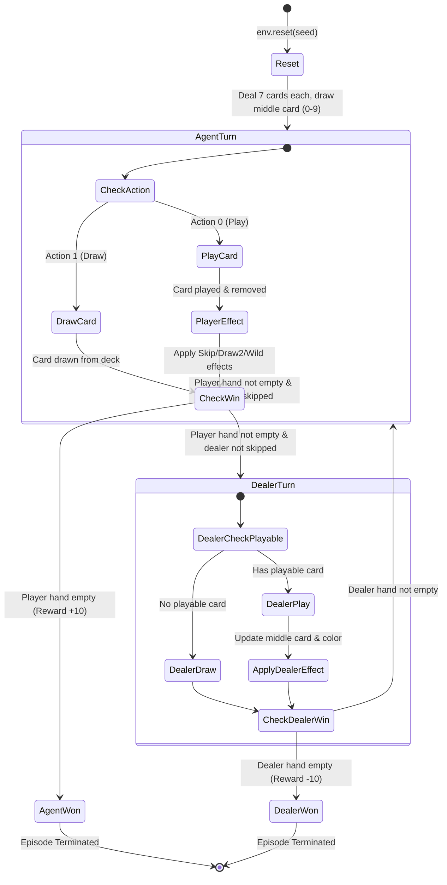

# UNO Environment (`cs272/Uno-v0`)

This is a custom 2-player UNO environment built for Gymnasium supporting an RL agent against an automated dealer baseline.

| Specification | Value |
| --- | --- |
| **Registration ID** | `cs272/Uno-v0` |
| **Action Space** | `Discrete(2)` |
| **Observation Space** | `Discrete(160)` |
| **Render Modes** | `"ansi"` |
| **Max Episode Steps** | 300 (via `TimeLimit` wrapper) |

---

## 1. Description & Card Encodings

The environment operates with a standard 108-card deck consisting of 4 colors (1 = Red, 2 = Blue, 3 = Green, 4 = Yellow) and special wild cards.

Cards are encoded as 3-digit integers:
- **Number Cards (`100` to `409`)**: First digit represents color (1-4), second digit is `0` (normal number card), third digit is the card value (0-9).
- **Skip (`110`, `210`, `310`, `410`)**: Skips opponent turn.
- **Reverse (`120`, `220`, `320`, `420`)**: Functions as Skip in 2-player games.
- **Draw Two (`130`, `230`, `330`, `430`)**: Forces opponent to draw 2 cards and skips their turn.
- **Wild (`500`)**: Changes current active color to the color most frequent in the player's hand.
- **Wild Draw Four (`600`)**: Changes active color, forces opponent to draw 4 cards, and skips opponent turn.

---

## 2. Action Space

`Discrete(2)` representing:
- `0`: **Play** a card (automatically plays the first playable card in hand matching current color or card type, or a wild card).
- `1`: **Draw** a card from the deck.

---

## 3. Observation Space Calculation

The observation space is represented by an integer state index $S \in [0, 159]$, calculated as:

$$\text{State} = (\text{Hand Size} \times 4 + \text{Color}) \times 2 + \text{Has Playable}$$

Where:
- $\text{Hand Size} = \min(\text{Player Cards}, 19) \in [0, 19]$ (where 19 represents 19 or more cards).
- $\text{Color} = \text{Current Color} - 1 \in [0, 3]$ (0 = Red, 1 = Blue, 2 = Green, 3 = Yellow).
- $\text{Has Playable} \in \{0, 1\}$ (1 if the agent holds at least one matching or wild card, else 0).

$$\text{Total States} = 20 \times 4 \times 2 = 160$$

---

## 4. State Transition & Game Flow Diagram

---

## 5. Rewards

- **Win Game** (Dealer hand empty or player hand empty): $+10.0$
- **Lose Game** (Dealer wins): $-10.0$
- **Play Card**: $+1.0$
- **Draw Card / No Playable Card**: $-1.0$

---

## 6. Reproducibility & Seeding

All stochastic deck shuffles and card draws strictly utilize Gymnasium's seeded `self.np_random` generator initialized via `env.reset(seed=seed)`.
